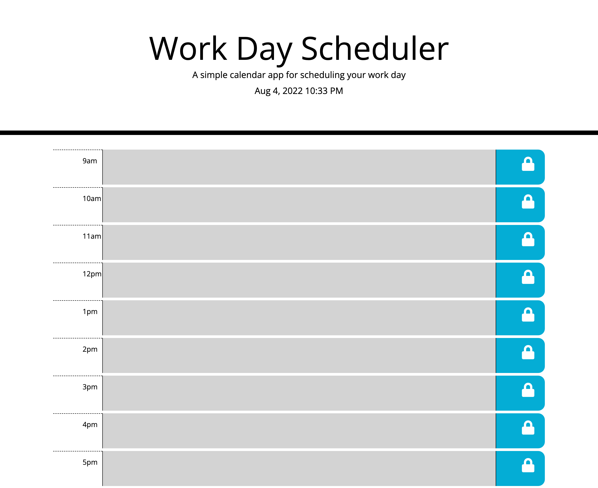

# Work Day Scheduler
The work day scheduler has been created with the busy person in mind.  It is a simple app that allows the user to record hourly events that take place during a standard business day.  
N.B.: Bootcamp study project

## Features
The exact date and time is recorded at the top of the page.  Color-coding of past, present, and future events allows the user to easily prioritize tasks.  

## Coming soon
Features soon to be implemented include a functioning save button, which will allow for information to remain in local storage.

https://raposamillar.github.io/work-day-scheduler/

